# LLE user manual

[Overview](../README.md) · [IDE and terminal guide](terminal-guide.md)

Lekmod Localization Editor (LLE) edits English source and translations locally, exchanges reviewed contributions and prepares localization for testing in Civilization V. This guide follows the browser interface. Python/Git are optional when using the Windows application.

Screenshots show the actual LLE interface with **demonstration data**, example Windows paths and sample connection statuses. `TXT_KEY_MANUAL_*` entries are examples. They do not show a verified installation on the reader's computer. No private vanilla snapshot, password or real account appears in the images.

## Contents

- [Start the editor](#start-the-editor)
- [Connect source, game and reference](#connect-source-game-and-reference)
- [Choose Translator or Developer](#choose-translator-or-developer)
- [Translate a row](#translate-a-row)
- [Find rows and arrange the table](#find-rows-and-arrange-the-table)
- [Autosave, Save and recovery](#autosave-save-and-recovery)
- [Apply to Project, Game or both](#apply-to-project-game-or-both)
- [Review errors in Troubleshoot](#review-errors-in-troubleshoot)
- [Edit English in Developer mode](#edit-english-in-developer-mode)
- [Exchange and merge contributions](#exchange-and-merge-contributions)
- [Switch mod versions and maintain LLE](#switch-mod-versions-and-maintain-lle)
- [Diagnose a problem](#diagnose-a-problem)

## Start the editor

1. Download the Windows ZIP from [LLE releases](https://github.com/Nail-Al/Lekmod/releases).
2. Extract **the whole ZIP** into a writable folder, for example `C:\Tools\LLE`. Keep its `localization/` folder beside `LekmodLocalizationEditor.exe`.
3. Run `LekmodLocalizationEditor.exe`. It opens a local browser page and keeps a small local server running.
4. Open **Settings** and connect a compatible source project as described below.

The editor listens on `127.0.0.1`. Launching the same application folder again reopens its existing session. Closing the browser tab leaves the server running; **Settings → Quit editor** stops it. An IDE checkout can also launch the editor using the [terminal guide](terminal-guide.md#prepare-and-open-the-editor).

## Connect source, game and reference

These are three separate inputs. Editing needs the source project; the other two serve different optional purposes.

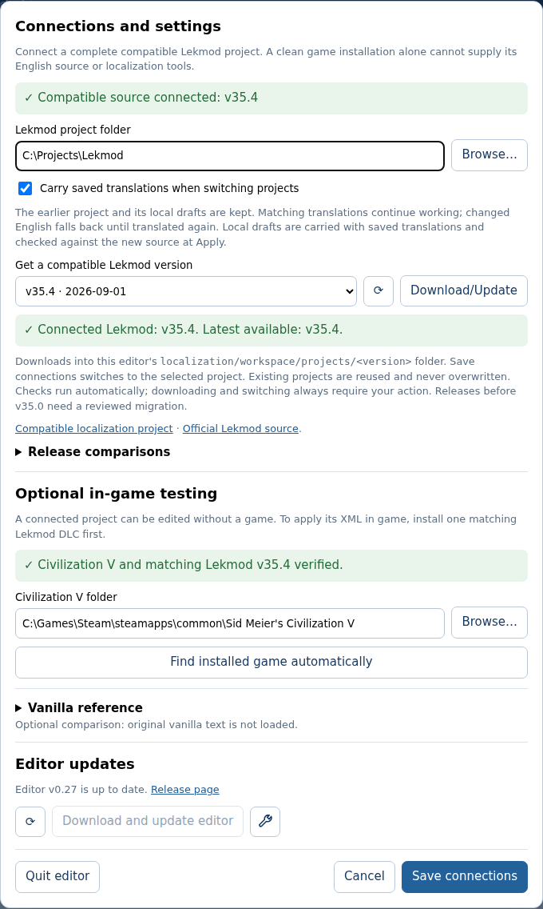

*Settings groups the connections; Save connections retains the chosen source/game folders.*

| Connection | Choose | Used for |
| --- | --- | --- |
| **Lekmod project folder** | Root of a complete compatible checkout or an LLE-downloaded project, containing `LEKMOD/` and `localization/`. | Current English, editable translation CSVs, generation and Project Apply. |
| **Civilization V folder** | The game's installation root, with one matching Lekmod DLC already installed. | Validation of the installed mod and Game Apply. |
| **Vanilla reference** | The team's verified snapshot, downloaded encrypted or imported as `.json.gz`. | Optional comparison with official English and target-language sentences. |

### Connect the source project

1. Open **Settings**.
2. Beside **Lekmod project folder**, click **Browse…** and choose the project root. Do not select the editor's own `localization/` folder or the game's installation as the source.
3. If you have no compatible checkout, select a supported release under **Get a compatible Lekmod version** and click **Download/Update**. Wait for it to finish.
4. Click **Save connections**. Preparation may restart the local server; keep the page open while it reconnects.
5. Check the header's **Source** badge and the successful source status in Settings.

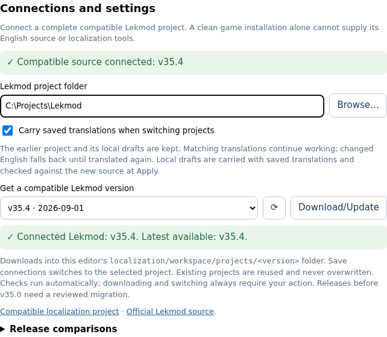

*The first Settings group connects editable mod files. Downloading a project and installing the mod in the game are separate tasks.*

Downloads create/reuse a separate folder under `localization/workspace/projects/<version>`. They do not overwrite a chosen existing project. **Save connections** selects the downloaded project. Invalid or incomplete sources leave the previous project available. Releases before v35.0 need a reviewed migration rather than automatic connection.

Leave **Carry saved translations when switching projects** checked to transfer matching saved translations and local drafts. The old project remains available; changed sources and conflicting destination edits require review. See [switching versions](#switch-mod-versions-and-maintain-lle).

### Connect the installed game

1. Install the matching complete Lekmod release using the [mod installation instructions](../../docs/installation.md).
2. In **Settings → Optional in-game testing**, use **Browse…** or **Find installed game automatically** to select the Civilization V installation root.
3. Check that the status reports the installed Lekmod version and that the header's **Game** badge says **matched**.
4. Click **Save connections** to retain the connection.

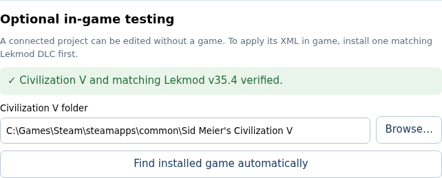

*Select the game root here. The installed DLC must match the connected project's version and rules.*

LLE checks for one compatible installed copy and invalid/missing mod files. A vanilla-only game, multiple Lekmod copies, or a version/rules mismatch cannot receive Game Apply. Settings reports the reason and offers installation instructions where appropriate. A game is optional: leave this field empty to translate, edit English, save work and exchange ZIPs using only Project.

### Load the language reference

1. Expand **Settings → Vanilla reference**.
2. Enter the team's encrypted snapshot link, or use the reset-to-team-link button.
3. Enter the **snapshot encryption password** supplied by the maintainer. This is separate from the storage provider's account password.
4. Click **Download, decrypt and verify** and wait for verification.
5. If you already have a team snapshot, choose it under **Optional local vanilla snapshot (.json.gz)** and click **Import and verify snapshot** instead.

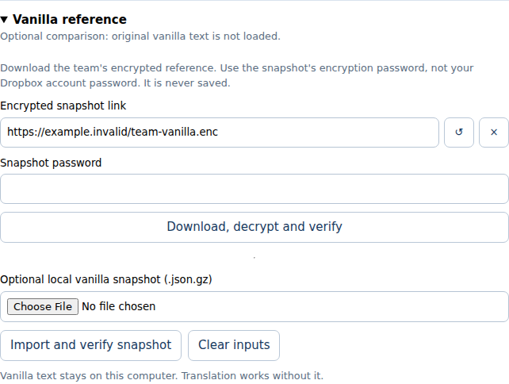

*The reference supplies comparison sentences. The screenshot's `example.invalid` link is a non-working example; use the team's actual link.*

LLE verifies the snapshot against shared fingerprints before replacing its local reference. It retains the verified copy and link, but does not save the password or include the snapshot in translation exports. Official comparison text is available for English, German, Spanish, French, Italian, Japanese, Korean, Polish, Russian and Traditional Chinese.

After loading it, open **Visible columns** and enable **Vanilla EN** and/or **Vanilla translation**. A new Lekmod key may have no vanilla equivalent. Editing still works without the full snapshot; the shared fingerprints support validation.

## Choose Translator or Developer

Use the mode button in the header to switch. Both modes share local drafts, explicit Saves, history and Apply, but edit different sources.

| | Translator | Developer |
| --- | --- | --- |
| Main task | Translate current Lekmod English into a selected language. | Edit canonical English text and permitted key operations. |
| Row identity | Language plus `TXT_KEY_*`. | English `Row`/`Replace` operation, source file and line. |
| Editable fields | Translation, Gender, Plurality and translator note. | English text and identifier; create/remove permitted keys. |
| Project result | `localization/translations/<locale>.csv`. | `localization/en_US/primary.xml`. |
| Import/export | Translation handoffs for selected languages. | English source handoffs. |
| Meaning of source changes | A changed English fingerprint makes an older translation stale. | English changes require review of dependent translations. |

Use Translator for localization work. Use Developer when the English itself needs correction or you are developing gameplay text. A new text key only appears in game after gameplay XML, SQL or Lua refers to it; structural migrations belong in an IDE.

## Translate a row

1. Choose **Translator**, a **Language**, and a **Category** or **All categories**.
2. Search by key or text; press **Enter** or click **Search**. The **×** clears the field and applied query. Typing alone does not submit a search.
3. Select a row. Read **Lekmod EN**, available comparisons, and its status.
4. Edit **My translation text** in the row panel. Preserve the needed substitutions and formatting; token chips copy tokens into the clipboard.
5. Set **Gender**, **Plurality**, and a **Translator note** when needed. Grammar fields offer common values and **Custom…**. Notes are for reviewers and never appear in game.
6. Wait for **Saved locally**. Use **Save** for an explicit restore point and **Apply** when you are ready to update a destination.

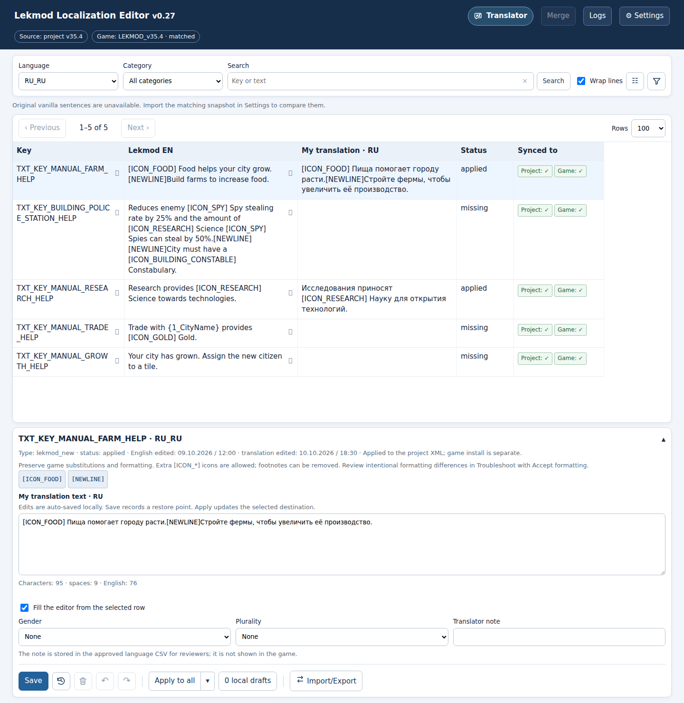

*The table shows source and working text; the panel edits the selected language/key. Save and Apply have different purposes.*

Character counts help compare length; they do not impose a maximum. **Fill the editor from the selected row** controls auto-fill. Turning it off offers to keep or clear the edit box; the switch alone does not remove a translation saved in Project.

### Interpret columns and status

| Column/type | Read it as |
| --- | --- |
| **Key** | Stable game identifier. |
| **Lekmod EN** | Current English, including relevant pending local English edits. |
| **My translation** | Current working text in the selected language. |
| **Vanilla EN / Vanilla translation** | Official comparison from the verified snapshot. |
| **Existing Lekmod translation** | Translation found in the mod's source data. |
| `lekmod_new` | English added by Lekmod. |
| `vanilla_modified` | Lekmod changed the original English. |
| `source_conflict` | English definitions disagree; developer source review is required. |
| **English edited / Translation edited** | Edit dates; hover for time-zone details. |
| **Changed in Lekmod** | Relevant releases in the available English comparison index. |
| **Synced to** | Whether this working version matches Project and Game separately. |

| Translation status | Meaning and next action |
| --- | --- |
| `draft` | Local text differs from Project. Review and Apply; Game may already contain this version. |
| `missing` | No saved Project translation. Write one or keep English fallback. |
| `stale` | Saved text belongs to older English. Review the current English before reusing it; runtime currently uses English fallback. |
| `applied` | Project translation is included in generated runtime XML. |
| `saved` | Translation is saved in CSV while shipped-XML generation is Off. |
| `needs_source_review` | Resolve conflicting English before applying a translation. |

## Find rows and arrange the table

Open **Filter** beside **Visible columns** to select type/operation, status, date range, mod version, or **Needs localization only**. Click **Apply filters** to use the selection; **Clear filters** resets the active mode's filters. Date ranges use the computer's calendar, including daylight-saving changes.

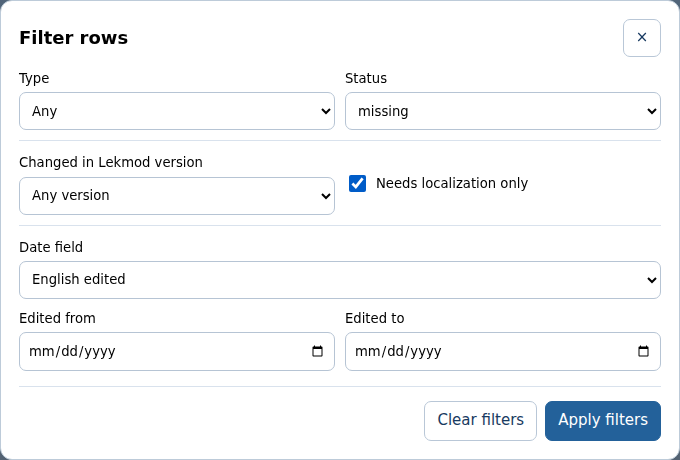

Use **Visible columns** to show comparison, review and file/history fields. Drag a heading to reorder it, or use Alt+Left/Right on a focused heading. Drag its right-edge handle to resize. Order, widths and filters are saved separately for Translator and Developer. **Rows** changes page size; **Wrap lines** and the collapsible editing panel help fit the workspace.

## Autosave, Save and recovery

| Operation | What it does | Writes Project/Game? |
| --- | --- | --- |
| Autosave | Preserves the current local draft after a short typing pause and before navigation. Incomplete work is allowed. | No. |
| **Save** / Ctrl+S | Records an explicit version of all local work in this project, across both modes and all languages. | No. |
| **Apply** | Validates saved drafts and updates the selected destination. | Yes, the chosen destination. |

You do not have to make an explicit Save before every Apply, but a Save provides a useful restore point. A failed autosave keeps the form and offers **Retry Save**; resolve that failure before leaving the page.

### Load a saved version

1. Click the clock beside **Save** to open **Saved versions**.
2. Save the current version first if you want to keep it.
3. Select a version and click **Load selected Save**.
4. Review the loaded local work. Apply if you also want to update Project or Game.

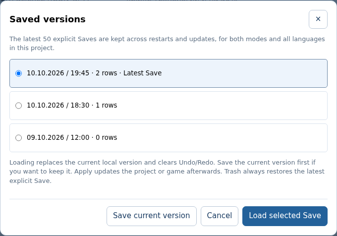

The latest **50 explicit Saves** survive restarts and editor updates. Loading replaces local work and clears Undo/Redo. It does not change the latest Save that the trash button restores.

**Undo** (Ctrl+Z) and **Redo** (Ctrl+Y or Ctrl+Shift+Z) work across rows, languages and modes. Consecutive typing is grouped. History retains up to **100 actions**, survives restarts and Apply, and drops the redo branch after a new edit. Formatting acceptance is also a local history action. While typing in a dialog, ordinary field shortcuts remain local to that field.

The trash button asks before restoring all local work to the latest explicit Save. Without a Save it restores the initial local version. This clears Undo/Redo. Apply afterwards if the restored content should replace destination text.

### Inspect or back up pending drafts

Open **Local drafts** to see pending work, including keys absent from current English. **Download draft backup** preserves incomplete drafts as JSON. **Discard this draft** removes one local draft after confirmation. Save/history/drafts belong to the connected project's private workspace.

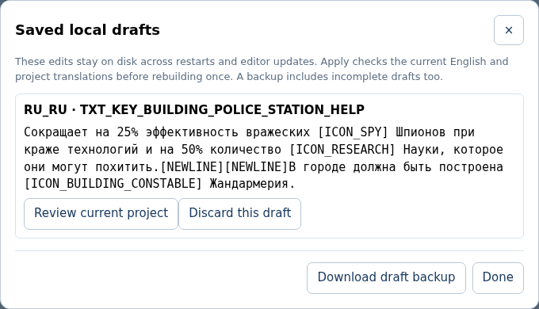

When Apply reports that the same row changed in an IDE or Merge, select **Review current project**. Read the current English/project text and your draft, then choose **Keep my draft against this source** only after reviewing its meaning and tokens. This updates the local baseline; Project changes only at the next Apply. Missing or structurally conflicted keys require developer/IDE review.

## Apply to Project, Game or both

Open the arrow beside **Apply** and choose a destination. The selection becomes the main button's action.

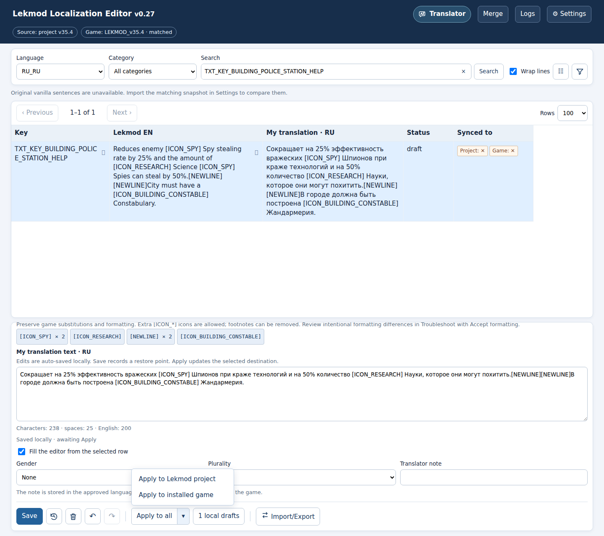

| Target | Result |
| --- | --- |
| **Apply to Lekmod project** | Writes canonical English/translation CSV changes and prepares generated Project XML. |
| **Apply to installed game** | Builds validated localization using the local working version and copies it into the matching installed mod; canonical Project inputs stay unchanged. |
| **Apply to all** | Applies to Project, then copies the resulting localization into Game. |

English is validated before dependent translations. Correct independent rows apply even when other rows are rejected. Rejected rows remain local and appear in Troubleshoot; their previous Game text is preserved. A translation depending on rejected English waits too. Connection, build or runtime-validation failures stop the relevant operation.

The batch is fixed when Apply begins; typing during it remains pending for a later Apply. LLE preserves unrelated IDE edits and detects conflicts on the same row.

### Read synchronization indicators

**Synced to** compares the current LLE version with each destination: **✓** matches, **✕** differs, **—** is unavailable. With both destinations connected, this column appears automatically and can be controlled through Visible columns.

For example, a Game-only Apply can leave **Status: draft**, **Project: ✕**, **Game: ✓**. Saving a restore point does not turn these indicators green. A late Game failure can leave Project already updated; read each destination independently and retry the failed target.

### Check text in the game

1. Close Civilization V completely before Game/All Apply. LLE checks game processes before preparing and immediately before replacing installed XML.
2. If **Close Civilization V first** appears, close the game and click **Retry**. The local draft is retained.
3. Apply, start Civilization V and check the affected screens in the game's selected language.

Installed XML is backed up before replacement. XML and localization-database checks do not launch the Civilization V engine. Players use generated language sections in `LEKMOD/Override/CIV5Units_Mongol.xml`; they do not need LLE or contributor CSVs.

## Review errors in Troubleshoot

1. Read the Apply notice: it reports the number of applied drafts and draft errors.
2. Open **Troubleshoot table**.
3. Compare **English at Apply**, **Current LLE text**, and **Reason**.
4. Use **Edit row** to fix the row, or explicitly accept an intentional formatting difference as described below.
5. Click **Apply again**. Edited rows are marked for recheck until validation runs again.

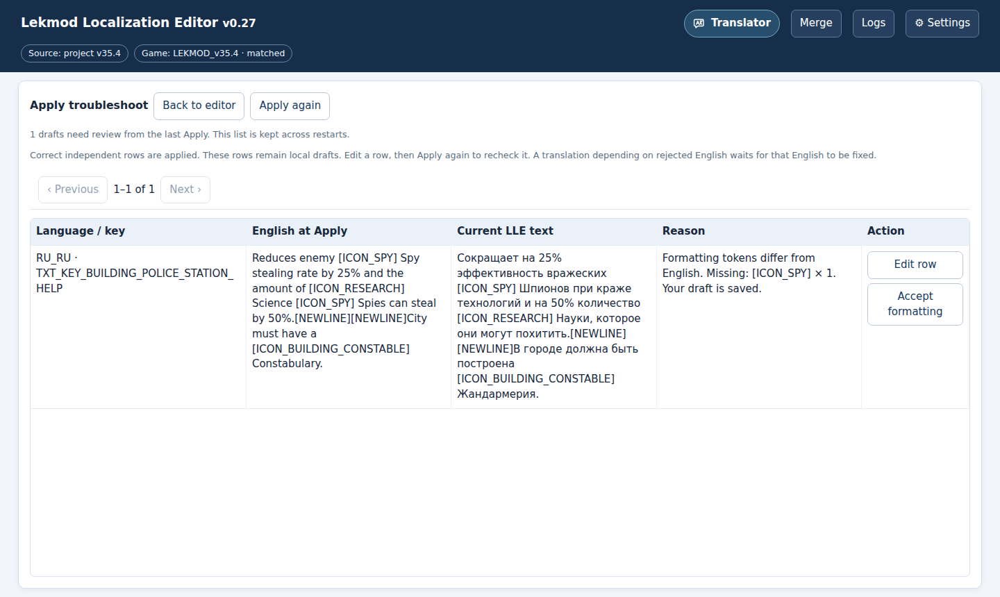

The report survives restarts. Rejected drafts are kept; independent valid rows have already applied.

### Accept an intentional formatting difference

Formatting tokens include icons, color/link tags, `[NEWLINE]`, `[TAB]`, numbered substitutions such as `{1_Name}`, and printf substitutions such as `%s`. The default check preserves expected counts, permits additional icons, ignores numeric footnotes/bracketed prose and allows reordering.

An adapted sentence can legitimately use a repeated icon fewer times. In the illustrated Police Station text, English has two `[ICON_SPY]` tokens while Russian has one because the second reference uses a pronoun.

1. Review which tokens are missing or unexpected.
2. Click **Accept formatting** on that formatting issue.
3. Read the confirmation and accept it for the exact text and current English.
4. **Apply again** to update a destination.

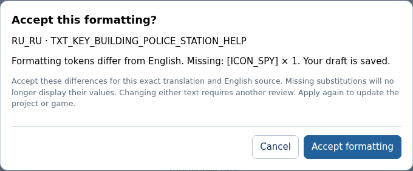

Acceptance leaves the translation unchanged and is bound to its source fingerprint, exact text and expected tokens. Changing either text requires a new review. It travels with the translation CSV and uses the same validation in LLE, generators, Merge and CI.

Missing substitutions will no longer display their values. Check this deliberately; a missing icon and a missing `{1_Name}` have different effects. Acceptance does not bypass stale English, conflicting edits, placeholders, missing keys, invalid XML or Game checks. The [terminal guide](terminal-guide.md#review-intentional-formatting) explains the equivalent IDE commands.

| Other reason | Resolution |
| --- | --- |
| English changed / stale fingerprint | Review current English and update/rebase the draft after checking its meaning. |
| Project translation changed in an IDE or Merge | Review both versions in Local drafts before choosing a new baseline. |
| Language placeholder remains | Replace the placeholder with actual translated text. |
| Translation depends on rejected English | Fix/apply the English draft first or together with the translation. |
| Conflicting/missing English key | Resolve the source definition or migration in Developer/IDE. |

## Edit English in Developer mode

1. Switch to **Developer**.
2. Find a key and select its `Row`/`Replace` operation.
3. Review its source file/line, existing English and references.
4. Edit **English source text** and wait for the local draft to save.
5. Save a restore point if needed, then Apply to the intended destination.

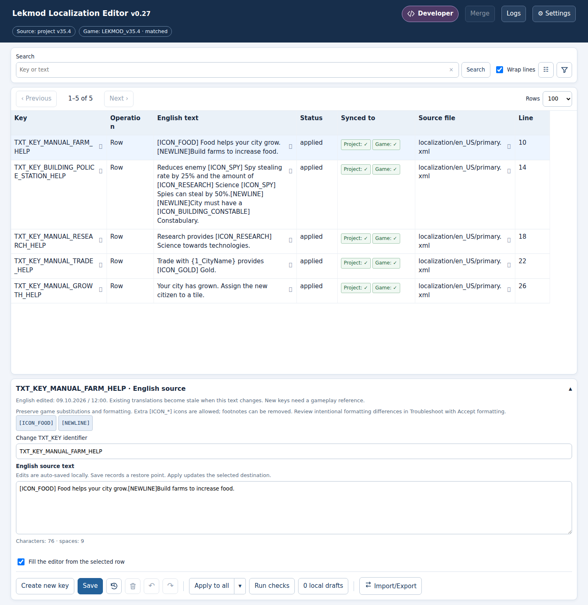

Developer **Status** distinguishes local `draft` from `applied` Project operations. Synchronization with Project/Game remains separate, including for newly created keys.

### Create a text key

1. Click **Create new key**.
2. Enter an unused `TXT_KEY_*` identifier and English text; review the proposed source file, line and `Row` operation.
3. Click **Create key** to save it locally.
4. Apply to Project to add it to `primary.xml`.
5. Add the gameplay reference in an IDE. Switch to Translator to translate the new source.

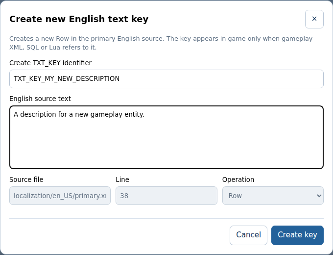

Adding text does not create a unit, building or other gameplay entity. Referenced/translated identifiers need an IDE migration for rename/removal. LLE blocks these operations to avoid broken references; unreferenced keys can use permitted removal. Duplicate or conflicting English definitions also require source review.

English changes alter source fingerprints. Existing translations remain in CSV for review, while runtime falls back to current English until a translation is approved against it. Matching English and translation drafts can Apply together.

## Exchange and merge contributions

### Send work as a handoff

1. In Translator, open **Import/Export**, select languages and click **Download selected translations ZIP**.
2. In Developer, use **Download English source ZIP** for English work.
3. Give the ZIP to a reviewer, who imports it and compares individual keys in Merge.

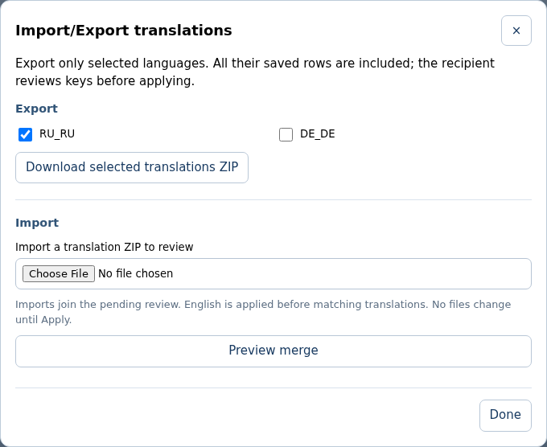

Translation exports include complete selected-language CSVs and valid local drafts. Dependent English edits are included for review. The ZIP has checksums and source metadata. Private snapshot text, passwords and settings are excluded. For incomplete drafts that cannot pass export validation, use **Local drafts → Download draft backup** instead.

### Review incoming work

1. Finish local drafts: Apply them to **Project**, or back them up and discard the ones you do not want. Merge cannot apply while local drafts remain.
2. Import English handoffs in **Developer** mode first. Choose a ZIP under **Import**, then **Preview merge**.
3. Review English decisions before importing dependent translation ZIPs. Additional imports join the same pending review.
4. For each replacement, explicitly choose **Keep current** or **Use incoming**. New rows use the Include checkbox. Identical rows are ignored.
5. Review dependent translations after English decisions; a source mismatch stays excluded. Check **Translations reset**, which lists locales whose older translations will fall back to English.
6. Select **Project folder** or **Project and installed game**, then **Apply reviewed changes**.
7. Review the resulting Project diff and test the affected game text when appropriate.

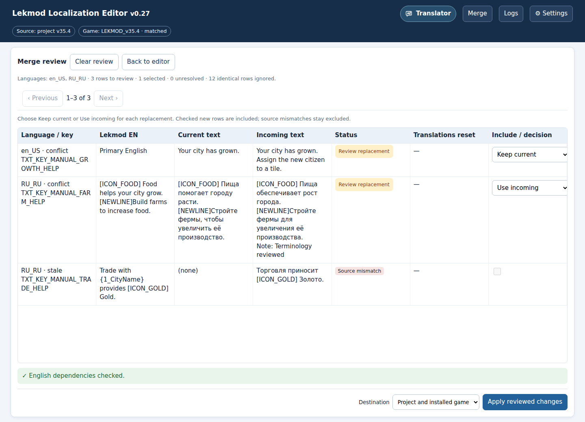

*The example keeps current English, chooses an incoming Russian translation, and excludes a source mismatch. Each replacement has an explicit decision.*

| Merge status | Action |
| --- | --- |
| **Ready to add / Ready** | Include the new or independently applicable row, or exclude it. |
| **Review replacement** | Compare text, grammar and notes, then choose Keep current or Use incoming. Unresolved replacements keep Apply disabled. |
| **Source mismatch** | Keep current; review/update the incoming work against current English. |
| **Needs IDE migration** | Review gameplay references and structural changes in an IDE. |

A later timestamp alone does not settle a conflict. Merge rechecks source hashes, backs up affected files and rebuilds Project. A failed rebuild restores changed inputs. If Project changed since preview, refresh/import and review the current versions. Pending packages and choices survive restarts; **Clear review** clears the pending review without writing Project.

Do not replace a team's entire CSV with an exported CSV: review and merge by language/key. The [terminal guide](terminal-guide.md#exchange-and-merge-handoffs) provides the same source checks and decisions through commands.

## Switch mod versions and maintain LLE

### Switch the source release

Settings lists compatible Lekmod releases. Select a release, **Download/Update**, then **Save connections**. Version checks alone do not switch projects or install Game files.

With translation carry enabled, matching translations continue; changed English is marked stale, conflicting destination edits are preserved, and unavailable keys are archived. Local drafts are carried and checked against the new source on Apply. Keep the earlier project for its drafts/history and review reported conflicts. Use **Changed in Lekmod**, the version filter and **Release comparisons** to inspect changes; **Synchronize comparison** can fetch an additional official comparison without downloading its full mod.

### Update or repair the application

Lekmod releases and LLE application versions are separate. In **Settings → Editor updates**, check the application version, then use **Download and update editor** when an update is available. Keep the page open while the server restarts and reconnects.

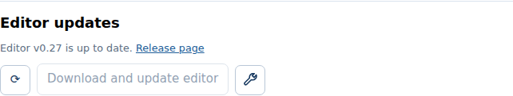

The wrench verifies packaged application files against the published release; **Fix version** repairs missing/changed files when offered. Updates retain project data, drafts, Saves, settings, table preferences, pending Merge reviews and the verified snapshot. An update failure reports recovery state and a diagnostic log path. See the [IDE repair command](terminal-guide.md#application-maintenance-and-reference-operations) for terminal-based recovery.

## Diagnose a problem

| Symptom | Check |
| --- | --- |
| Source project rejected | Choose/download a complete compatible source root; a game installation alone cannot supply it. |
| Vanilla columns empty | Verify/import the team snapshot and enable its columns. New keys can have no equivalent. |
| Apply skipped rows | Open Troubleshoot; edit or accept intentional formatting, then Apply again. |
| Game/All unavailable | Settings must verify exactly one matching installed Lekmod copy. |
| Game is running | Close Civ V completely, then Retry. |
| Game shows `TXT_KEY_*` | Close Civ V, inspect Logs/game diagnostics, verify files and version, prepare/apply localization and retest. |
| Merge Apply disabled | Resolve replacements and finish local drafts; check that a dependency review is not still running. |
| Connection lost during update | Allow the server to restart; consult the reported update/startup logs if reconnection fails. |
| Missing/changed application files | Use the wrench/Fix version or the terminal repair command. |

**Logs** opens the local activity journal and offers **Download log** and **Download game diagnostics**. Diagnostic actions read installed/cached localization without deleting the cache. Logs exclude text, passwords and snapshot contents. Detailed application/update logs and backups are under the private `localization/workspace/` folder; include the relevant diagnostic report when asking a maintainer for help.

For canonical files, commands, checks and PR preparation, continue with the [IDE and terminal guide](terminal-guide.md).
